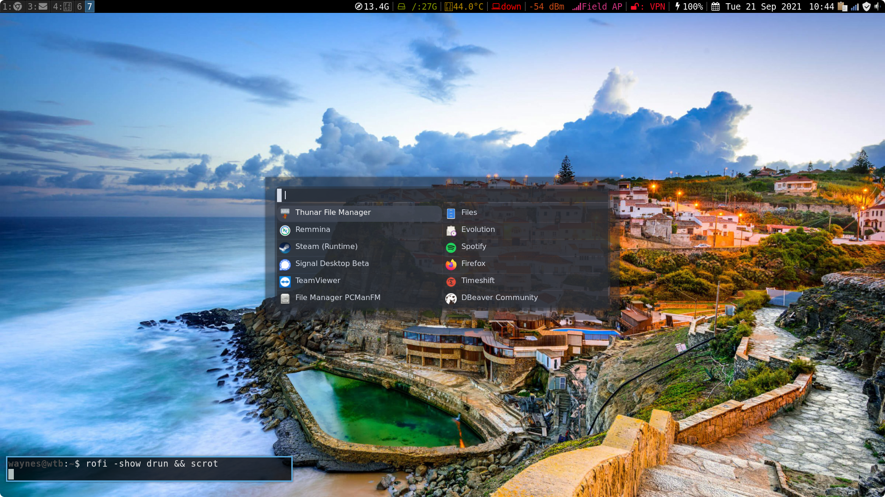

# My work laptop i3 Config
i3-gaps dotfiles Dell Tough Book build on Arch GNU/Linux

## Install
---
Install the following applicaitons to you system:

* xorg-xbacklight
* i3-gaps
* i3-blocks
* scrot
* htop
* ttf-font-awesome
* redlight
* rofi
* compton/which is called picom now
* nm-applet
* volumeicon
* clipit
* openvpn
* i3lock
* imagemagik
* i3-wallpapers
* i3-scrot
* i3-default-artwork
* feh
* pavucontrol

### AUR Using Yay

* colorpicker
* spotify
* signal-desktop-beta
* steam-manjaro

### Extra Install

* newsboat
* profanity
* pidgin
* evolution

### Screenfetch

### Rofi

